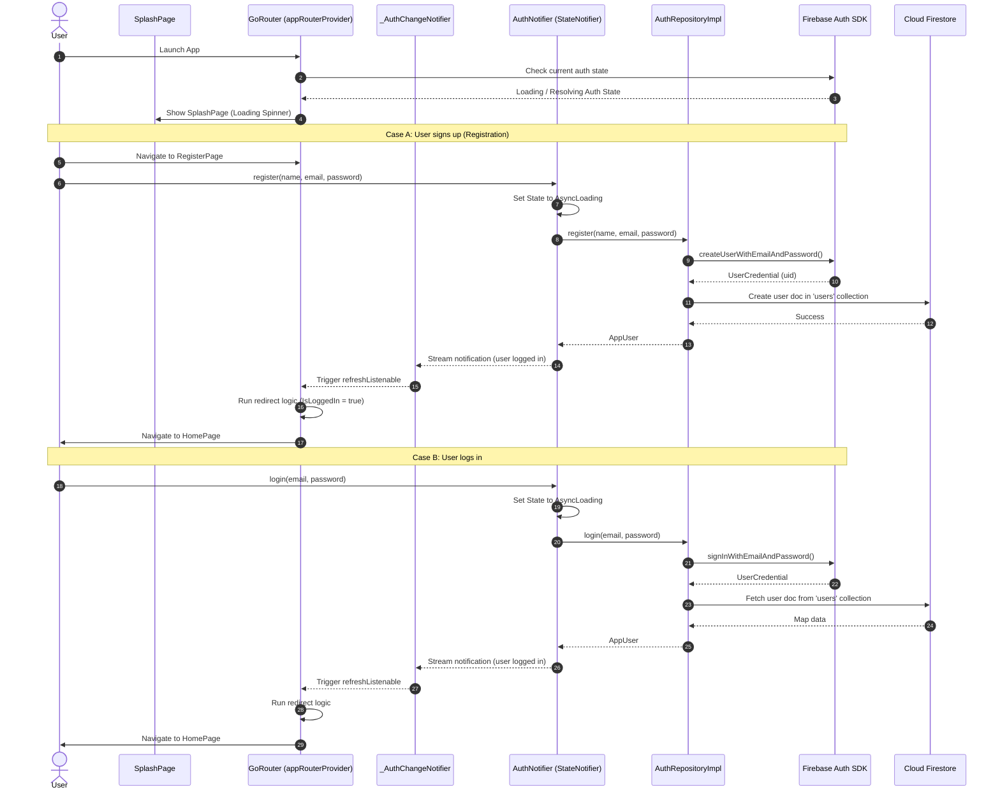
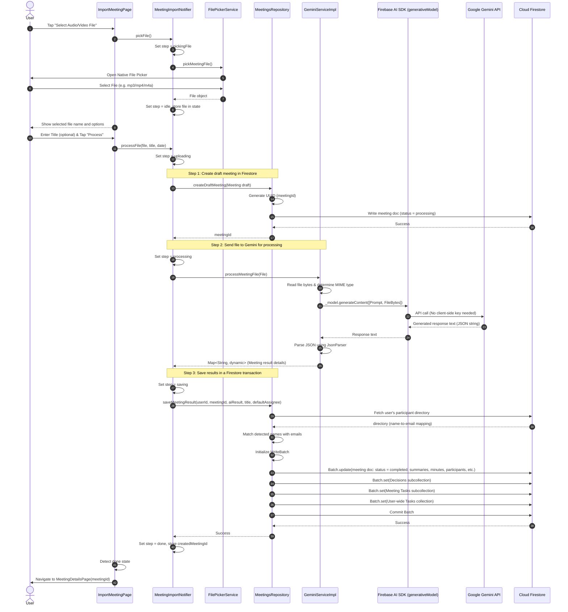
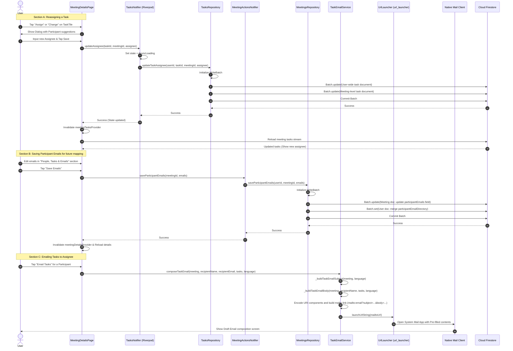

# MeetFlow AI — Sequence Diagrams Documentation

This document contains the sequence diagrams for **MeetFlow AI**, mapping out the interaction flow between the presentation, domain, data, and service layers, as well as the external integrations (Firebase Auth, Cloud Firestore, and the Google Gemini API via Firebase AI).

The diagrams are written using **Mermaid.js** syntax and can be rendered natively in GitHub, VS Code (with Markdown Preview extensions), or any Mermaid-compatible Markdown reader.

---

## 1. User Authentication & Session Routing Flow

This diagram illustrates how user authentication actions (registering and logging in) flow from the presentation layer (using Riverpod `StateNotifier`) through the repositories to Firebase Authentication and Cloud Firestore, and how `GoRouter`'s refresh listener automatically guards and redirects routes.

---

## 2. Audio/Video File Import & AI Meeting Analysis Flow

This diagram shows the end-to-end flow of importing a meeting from a local audio/video file. It describes how a draft meeting is created, uploaded, analyzed by the Google Gemini model using the Firebase AI SDK, parsed from JSON, and saved into Firestore using batch operations to preserve transactional integrity.

---

## 3. Task Management, Assignee Reassignment & Email Distribution Flow

This diagram covers the flow of updating task assignments and launching email dispatch. Because a task has double entries in Firestore (one under the specific meeting doc subcollection, and one under the main user's tasks collection), assigning a task commits a batch update. Composing emails builds a mailto URL using a designated translation (Arabic/English) and invokes `url_launcher` to redirect to the system email composer.

